# Eathy Ops (小红书智能运营系统)

Eathy Ops 是一个全自动化的**小红书内容生产与发布流水线**，专为 Eathy App 的内容营销设计。它能自动从全球 RSS 源与 NewsAPI 采集最新资讯，经过 AI 筛选、风格决策、文案创作与配图生成，最终自动发布到小红书。

## 🌟 核心特性

- **全自动采集**: 监控 FDA、Healthline、EWG 等权威数据源。
- **AI 智能选品**: 使用大模型筛选符合账号人设（"成分揭秘"、"避雷指南"）的高价值资讯。
- **🧠 AI 风格决策 (新)**:
  - 根据文章内容与情感色彩，自动选择最匹配的**文案风格**（如“情绪故事”、“硬核科普”）与**配图风格**（如“警示避雷”、“极简图表”）。
  - 支持多套人设策略，配置灵活。
- **多模态生成**:
  - **文案**: 自动生成爆款标题、正文及标签（MiniMax M2.5 / DeepSeek 等 OpenAI 兼容模型）。
  - **配图**: 生成高质量、符合小红书审美的竖版配图（Gemini 3 Pro Image Preview）。
- **智能调度**:
  - 后台守护进程，每天定时（08:00, 12:00, 20:00）发布。
  - 支持随机抖动 (±30分钟)，模拟真人操作。
- **自动发布**: 通过 MCP 服务直接发布笔记到小红书 App。

## 🛠️ 架构概览

```mermaid
graph TD
    A[RSS/NewsAPI] -->|采集| B(内容聚合池)
    B -->|AI 筛选| C{ArticleSelector}
    C -->|选中文章| D[StyleManager]
    D -->|AI 决策| E[文案风格: 情绪故事]
    D -->|AI 决策| F[配图风格: 警示红黑]
    E -->|生成| G[MiniMax 文案]
    F -->|生成| H[Gemini 配图]
    G & H -->|发布| I["小红书发布器 (MCP)"]
```



## 🚀 快速开始

### 1. 环境准备

确保已安装 Python 3.10+ 和 Node.js (用于 MCP 服务)。

```bash
# 克隆项目
git clone ...
cd eathy-xhs

# 创建虚拟环境并安装依赖
python -m venv .venv
source .venv/bin/activate
pip install -e .
```

### 2. 配置

复制示例配置文件：

```bash
cp .env.example .env
# 编辑 .env 填入 API Keys (MINIMAX_API_KEY, IMAGEN_API_KEY, NEWS_API_KEY)
```

检查 `config.yaml`（默认已配置好）：
- `minimax.api_type`: AI 接口类型，`anthropic`（默认）或 `openai`（OpenAI 兼容接口）。
- `prompts`: 指向提示词库路径。
- `schedule`: 设置发布时间。

**切换 AI Provider：**

默认使用 MiniMax Anthropic 兼容接口，无需额外配置。如需切换到 OpenAI 兼容接口（如 DeepSeek），修改 `config.yaml`：

```yaml
minimax:
  api_type: openai
  api_key: ${AI_API_KEY}
  model: deepseek-chat
  base_url: https://api.deepseek.com
```

### 3. 运行

**单次手动运行：**
```bash
eathy run
# 或 dry-run 模式（不发布）
eathy run --dry-run
```

**启动自动调度（守护进程）：**
```bash
# 方式一：在前台运行调度器
eathy schedule

# 方式二：安装为 macOS 系统服务（推荐）
./scripts/install.sh
# 服务将开机自启，后台静默运行
```

## 🎨 风格库配置 (Prompts)

本系统采用**配置驱动**的提示词管理。所有风格均在 `prompts/` 目录下定义，无需修改代码即可新增策略。

- **`prompts/filter/default.yaml`**: 定义选品标准和账号人设。
- **`prompts/copywrite/styles.yaml`**: 定义文案风格库。
  - *示例风格*: `emotional_story` (情绪故事), `hardcore_analysis` (硬核科普), `default_viral` (标准爆款)。
- **`prompts/image/styles.yaml`**: 定义配图风格库。
  - *示例风格*: `food_warning` (食品避雷), `ingredient_analysis` (成分分析), `brand_teardown` (品牌拆解)。

要添加新风格，只需在对应的 YAML 文件中追加新的 `id` 和 `prompt` 描述即可。

## 📂 目录结构

```
.
├── config.yaml          # 主配置文件
├── prompts/             # 提示词库
│   ├── filter/
│   ├── copywrite/
│   └── image/
├── src/
│   └── eathy/
│       ├── scheduler.py # 调度器核心
│       ├── pipeline.py  # 任务流水线
│       ├── prompts.py   # 风格管理器
│       ├── providers/
│       │   ├── base.py          # AIProvider Protocol
│       │   ├── minimax.py       # MiniMax (Anthropic 兼容)
│       │   ├── openai_compat.py # OpenAI 兼容 Provider
│       │   └── claude.py        # Claude Provider
│       └── ...
├── scripts/             # 安装脚本
└── launchd/             # macOS 服务配置
```

## 📋 常见命令

- `eathy run`: 手动触发一次流水线。
- `eathy schedule`: 启动调度器。
- `eathy history`: 查看发布历史。
- `./scripts/uninstall.sh`: 卸载后台服务。

## 📝 开发指南

- **添加新模型**: 在 `src/eathy/providers/` 新增 Provider 类，实现 `generate(prompt, system) -> str` 方法即可。
- **修改发布逻辑**: 修改 `src/eathy/publish/xhs.py`。
- **运行测试**: `pytest`。
